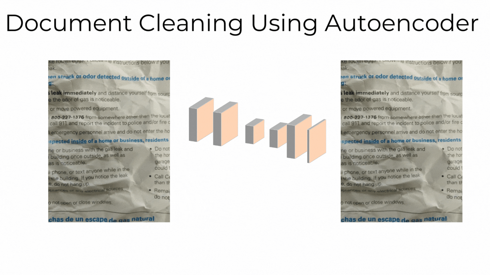

## Dataset
- Download the dataset from [Kaggle](https://www.kaggle.com/c/denoising-dirty-documents)
- Place `train`, `train_cleaned`, and `test` in `data` folder.

## Training
- Run `Train.ipnyb`

## Inference
For Inference on any dirty document (of any size):
$python inference.py --input_image = ""./images/i_img.jpeg$
- `input_image`: path to image to be cleaned

